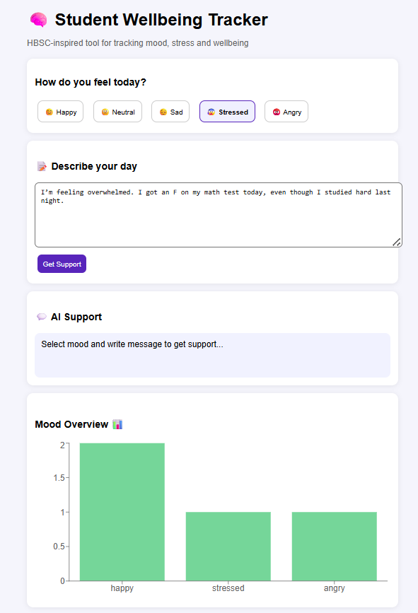
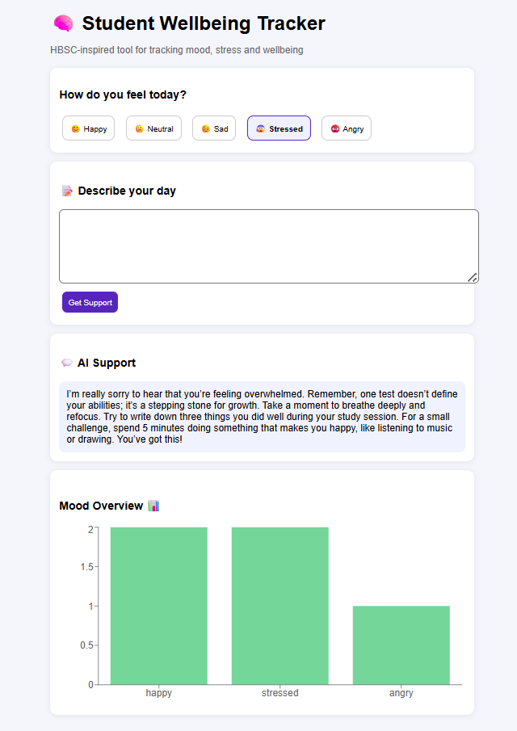
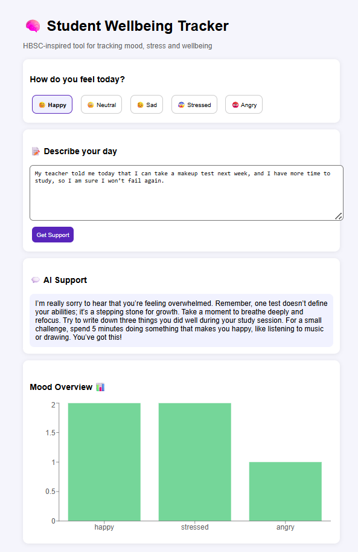
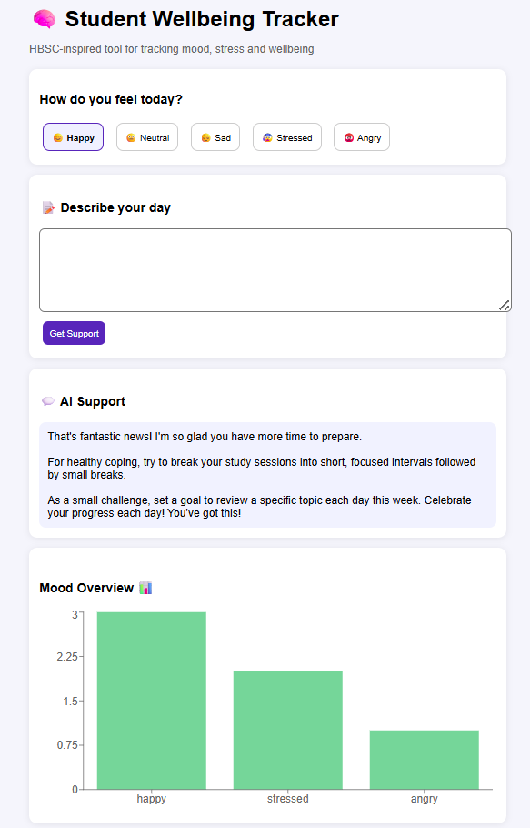

# 🧠 Student Wellbeing Tracker – HBSC Inspired Digital Solution

## 🧩 Тип на проект
Ова е **AI + Data-driven веб апликација** која комбинира:
- следење на расположение
- емоционална саморефлексија
- AI поддршка
- визуелизација на податоци

---

## 🧠 1. Истражување (HBSC контекст)

HBSC (Health Behaviour in School-aged Children) студијата покажува дека кај адолесцентите често се присутни различни предизвици поврзани со менталното и емоционалното здравје.

Врз основа на HBSC податоците, идентификувани се следниве проблеми кај младите:

- висок ниво на стрес кај ученици
- емоционална нестабилност и анксиозност
- намалена свесност за сопственото ментално здравје
- училишен притисок и оптовареност
- недостаток на алатки за саморефлексија и следење на расположение

Овие фактори негативно влијаат врз добросостојбата, мотивацијата и квалитетот на секојдневниот живот на младите.

---

## 💡 2. Дефинирање на идеја

### 📌 Проблем кој се решава:
Проектот го адресира проблемот на недоволна самосвесност и следење на менталното здравје кај учениците, како и недостиг од дигитални алатки за емоционална поддршка.

---

### 🎯 Целна група:
Апликацијата е наменета за ученици и адолесценти на возраст од 11 до 18 години, со фокус на нивната емоционална добросостојба и справување со секојдневен стрес.

---

### ⚙️ Како функционира решението:

Корисникот:
- избира тековно расположение (mood)
- внесува краток опис за својот ден
- добива AI-поддршка во форма на совет и охрабрување
- податоците се зачувуваат локално (localStorage)
- се прикажува визуелизација на емоционалните трендови преку график

---

### 🌱 Очекуван impact:

Решението има за цел да:
- ја зголеми свесноста за менталното здравје кај младите
- поттикне саморефлексија и емоционална писменост
- помогне во препознавање на стресни обрасци
- придонесе кон подобра психолошка добросостојба

---
## 📸 Преглед на апликацијата (Screenshots)

---
## 🚀 Заклучок

Овој проект претставува едноставно, но функционално дигитално решение инспирирано од HBSC истражувањето, кое комбинира следење на расположение, емоционална саморефлексија и AI поддршка со цел подобрување на менталното здравје кај младите.